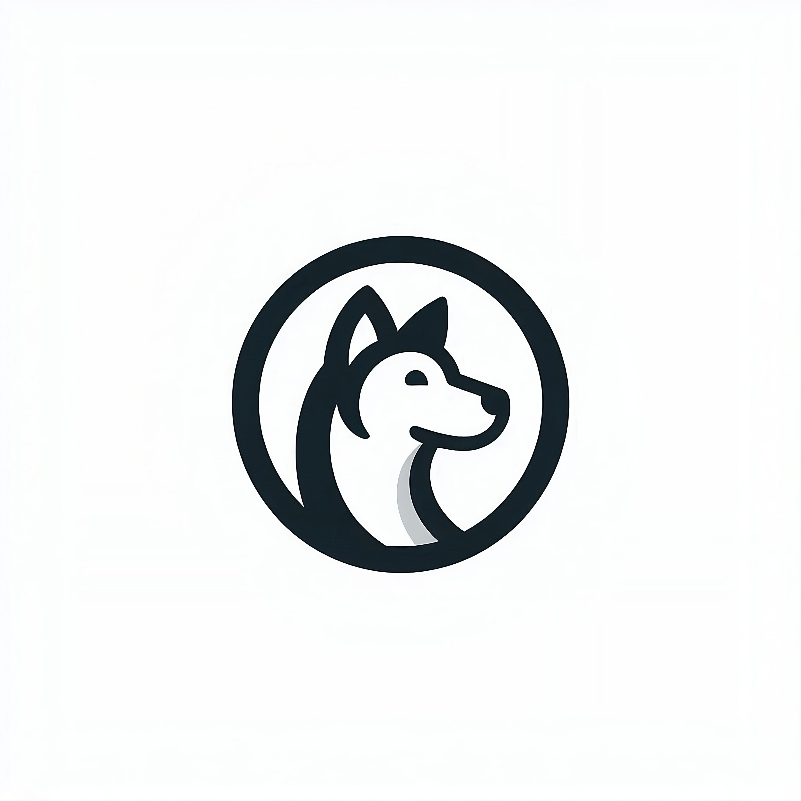

# Welcome to Safecy

Safecy is dedicated to building safety-related projects aimed at enhancing security, privacy, and safety for users across various domains. Our mission is to create tools and solutions that protect individuals and organizations from potential risks and threats.

## Projects

### Unity Guard

- **Description**: Unity Guard is a security tool for Unity projects. It scans assets and detects malicious code patterns.
- **GitHub Repository**: [Unity Guard Repository](https://github.com/safecy/unity-guard)

### Password Generator

- **Description**: A secure, customizable password generator built with Astro.JS to create strong, unique passwords effortlessly.
- **GitHub Repository**: [Password Generator Repository](https://github.com/safecy/password-generator)

### VRCPrivacyGuard

- **Description**: A Rust application for managing blocked domains in the hosts file on Windows systems, providing backup, modification, and rollback functionalities.
- **GitHub Repository**: [VRCPrivacyGuard](https://github.com/safecy/VRCPrivacyGuard)

And many [more projects!](https://github.com/orgs/safecy/repositories)

## Vision

At Safecy, we envision a safer digital landscape where users can navigate and work without compromising their security and privacy. By leveraging cutting-edge technologies and robust methodologies, we aim to empower individuals and businesses to stay protected in today's interconnected world.

## Contributions

We welcome contributions from the community to improve our existing projects and develop new tools that promote safety and security. If you're interested in contributing, please check out our projects on GitHub and feel free to open issues or pull requests.
